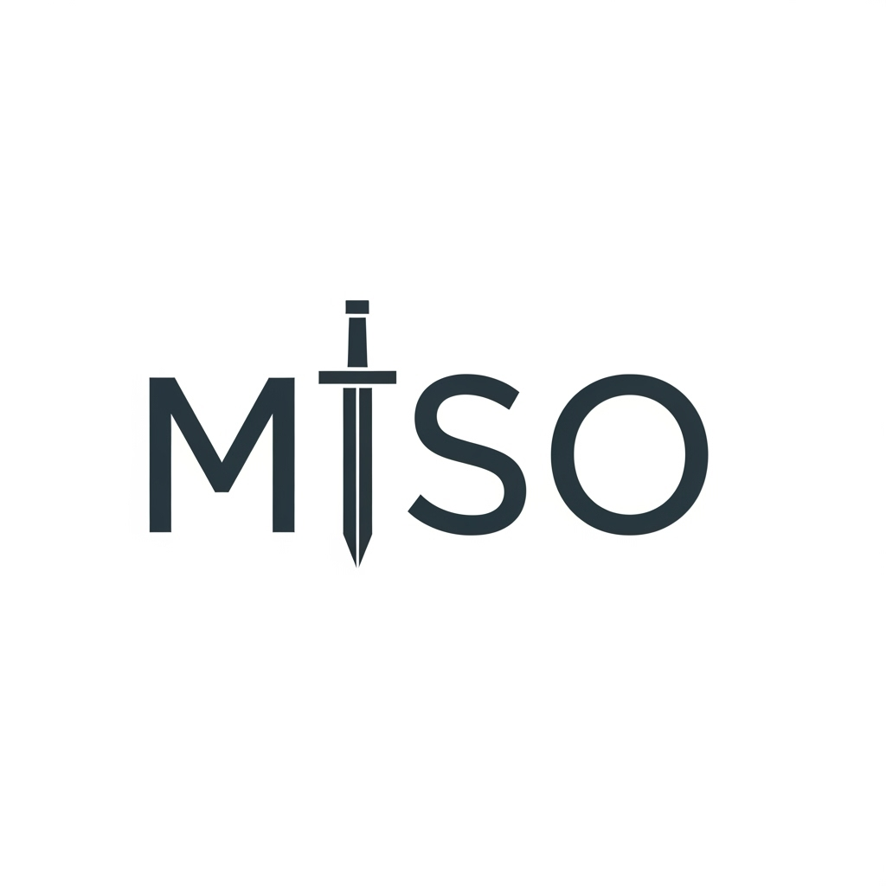

<div align="center">
  
  <h1>MISO_Cursor_WindSurf Trial Resetter</h1>
  <p>
    An application designed to reset software trial periods by deeply cleaning leftover files and registry entries on Windows.
  </p>
  <p>
    
    
    
    
  </p>
</div>

---

<details>
<summary><strong>🇬🇧 English Readme</strong></summary>
<br>

## ✨ Features

- **Application Remnant Cleaner:** Finds all related files and registry keys on your system by simply dragging and dropping an application's `.exe` file.
- **Smart Filtering:** Analyzes the publisher based on file paths and registry keys to filter out irrelevant results (e.g., Windows system files), preventing accidental deletion of critical data.
- **Deep Scan:** Thoroughly scans common application installation locations like `Program Files`, `%APPDATA%`, `%LOCALAPPDATA%`, as well as the Windows Registry.
- **User-Friendly:** Designed with an intuitive interface that anyone can use without requiring technical expertise.

## 🚀 How to Reset a Trial Version

For a successful reset, it is crucial to follow the steps below **in order and completely**.

### Step 1: Apply Trial Resetter Settings

First, we will perform the basic reset operations within the application itself.

1.  Run the application and switch to the **Trial Resetter** view from the left menu.
2.  Use the **"Basic"** and **"Advanced"** options on this screen to perform the necessary reset operations. These steps clear known trial keys and settings.

### Step 2: Deep Clean Application Remnants

Now, we will perform a deep clean of the "remember me" notes that the software keeps on your computer.

1.  Switch to the **App Cleaner** view from the left menu.
2.  Find the main executable file (`.exe`) of the software you want to reset (usually located under `C:\Program Files\...`).
3.  Drag and drop this `.exe` file into the **"Drop .exe here"** area in the application.
4.  The application will automatically start scanning and list all associated files and registry entries.
5.  Once the scan is complete, ensure all found items are selected and confirm the deletion by clicking the **"Delete Selected Items"** button.

### Step 3: Change Your IP Address (Important!)

Some software links the license not only to your computer but also to your internet (IP) address. Therefore, you need to change your IP address after cleaning the remnants.

- **Use a VPN:** The easiest and most effective method is to use a VPN service. Activate the VPN and connect to a different country or city.
- **Reset Your Modem:** If you have a dynamic IP address, turning your internet modem off, waiting for 30 seconds, and then turning it back on will usually get you a new IP address.

### Step 4: Enjoy!

After completing all the steps above, you can restart the software you wanted to reset. It will behave as if it has never been installed before, and your trial period will be reset.

## 🛠️ Development Environment Setup

If you want to run or develop the project on your local machine:

```bash
# Clone the project
git clone <your_project_url>

# Navigate to the directory
cd trial_resetter

# Install the necessary packages
npm install

# Start the development server
npm run dev
```

## 🤝 Contributing

Contributions are welcome! Please feel free to open a pull request or create an issue.

</details>

<br>

<details>
<summary><strong>🇹🇷 Türkçe Readme</strong></summary>
<br>

## ✨ Özellikler

- **Uygulama Kalıntısı Temizleyici:** Bir uygulamanın `.exe` dosyasını sürükleyip bırakarak sisteminizdeki ilgili tüm dosyaları ve kayıt defteri anahtarlarını bulur.
- **Akıllı Filtreleme:** Alakasız sonuçları (örn. Windows sistem dosyaları) elemek için dosya yollarına ve kayıt defteri anahtarlarına göre yayımcıyı analiz eder, böylece yanlışlıkla önemli bir şeyi silmenizi önler.
- **Derin Tarama:** `Program Files`, `%APPDATA%`, `%LOCALAPPDATA%` gibi yaygın uygulama kurulum konumlarının yanı sıra Windows Kayıt Defteri'ni de derinlemesine tarar.
- **Kolay Kullanım:** Sezgisel arayüzü ile teknik bilgi gerektirmeden herkesin kullanabileceği şekilde tasarlanmıştır.

## 🚀 Deneme Sürümü Nasıl Sıfırlanır?

Bir yazılımın deneme sürümünü sıfırlamak için aşağıdaki adımları **sırasıyla ve eksiksiz olarak** uygulamanız kritik öneme sahiptir.

### Adım 1: Trial Resetter Ayarlarını Uygulayın

İlk olarak, uygulamanın kendi içerisindeki temel sıfırlama işlemlerini yapacağız.

1.  Uygulamayı çalıştırın ve sol menüden **Trial Resetter** görünümüne geçin.
2.  Bu ekrandaki **"Basic"** ve **"Advanced"** seçeneklerini kullanarak gerekli sıfırlama işlemlerini gerçekleştirin. Bu adımlar, bilinen deneme anahtarlarını ve ayarlarını temizler.

### Adım 2: Uygulama Kalıntılarını Derinlemesine Temizleyin

Şimdi, yazılımın bilgisayarınızda tuttuğu "beni hatırla" notlarını derinlemesine sileceğiz.

1.  Sol menüden **App Cleaner** görünümüne geçin.
2.  Deneme sürümünü sıfırlamak istediğiniz yazılımın ana yürütülebilir dosyasını (`.exe`) bulun (genellikle `C:\Program Files\...` altında bulunur).
3.  Bu `.exe` dosyasını uygulamadaki **"Drop .exe here"** alanına sürükleyip bırakın.
4.  Uygulama otomatik olarak taramayı başlatacak ve yazılımla ilişkili tüm dosya ve kayıt defteri girdilerini listeleyecektir.
5.  Tarama tamamlandığında, bulunan tüm öğelerin seçili olduğundan emin olun ve **"Delete Selected Items"** düğmesine tıklayarak silme işlemini onaylayın.

### Adım 3: IP Adresinizi Değiştirin (Önemli!)

Bazı yazılımlar, lisansı sadece bilgisayarınıza değil, aynı zamanda internet (IP) adresinize de bağlar. Bu nedenle, kalıntıları temizledikten sonra IP adresinizi değiştirmeniz gerekir.

- **VPN Kullanımı:** En kolay ve etkili yöntem bir VPN hizmeti kullanmaktır. VPN'i aktif edip farklı bir ülkeye veya şehre bağlanın.
- **Modem Resetleme:** Eğer dinamik bir IP adresiniz varsa, internet modeminizi kapatıp 30 saniye bekledikten sonra yeniden açmak genellikle yeni bir IP adresi almanızı sağlar.

### Adım 4: Keyfini Çıkarın!

Yukarıdaki tüm adımları tamamladıktan sonra, deneme sürümünü sıfırlamak istediğiniz yazılımı yeniden başlatabilirsiniz. Yazılım, daha önce hiç kurulmamış gibi davranacak ve deneme süreniz sıfırlanmış olacaktır.

## 🛠️ Geliştirme Ortamı Kurulumu

Projeyi yerel makinenizde çalıştırmak veya geliştirmek isterseniz:

```bash
# Projeyi klonlayın
git clone <proje_adresi>

# Dizine gidin
cd trial_resetter

# Gerekli paketleri yükleyin
npm install

# Geliştirme sunucusunu başlatın
npm run dev
```

## 🤝 Katkıda Bulunma

Katkılarınızı bekliyoruz! Lütfen bir pull request açmaktan veya issue oluşturmaktan çekinmeyin.

</details> 